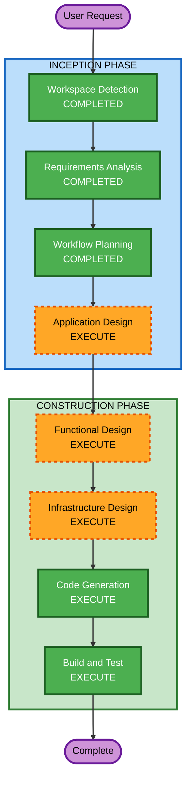

# Execution Plan

## Detailed Analysis Summary

### Change Impact Assessment
- **User-facing changes**: Yes - 新規 API エンドポイント提供
- **Structural changes**: Yes - 新規プロジェクト構築
- **Data model changes**: No - データ永続化なし
- **API changes**: Yes - OpenAI TTS 互換 API を新規作成
- **NFR impact**: No - 基本レベルのエラーハンドリング、セキュリティルールスキップ

### Risk Assessment
- **Risk Level**: Low（新規プロジェクト、既存システムへの影響なし）
- **Rollback Complexity**: Easy（独立したサービス）
- **Testing Complexity**: Moderate（VOICEVOX API との結合テストが必要）

## Workflow Visualization

## Phases to Execute

### INCEPTION PHASE
- [x] Workspace Detection (COMPLETED)
- [x] Requirements Analysis (COMPLETED)
- [ ] User Stories - SKIP
  - **Rationale**: API プロキシであり、ユーザーペルソナや複雑なユーザーフローは不要
- [x] Workflow Planning (COMPLETED)
- [ ] Application Design - EXECUTE
  - **Rationale**: 新規コンポーネントの設計が必要（ハンドラー、VOICEVOX クライアント、マッピングモジュール等）
- [ ] Units Generation - SKIP
  - **Rationale**: 単一ユニット（1 Lambda）のため分割不要

### CONSTRUCTION PHASE
- [ ] Functional Design - EXECUTE
  - **Rationale**: API 変換ロジック、voice-mapping、パラメータ変換のビジネスルール定義が必要
- [ ] NFR Requirements - SKIP
  - **Rationale**: セキュリティルールスキップ、基本的なエラーハンドリングのみ、特別な NFR なし
- [ ] NFR Design - SKIP
  - **Rationale**: NFR Requirements をスキップするため
- [ ] Infrastructure Design - EXECUTE
  - **Rationale**: CDK スタック設計（API Gateway HTTP API + Lambda + API Key 認証）が必要
- [ ] Code Generation - EXECUTE (ALWAYS)
  - **Rationale**: Rust Lambda + CDK コード生成
- [ ] Build and Test - EXECUTE (ALWAYS)
  - **Rationale**: ビルド・テスト手順の作成

### OPERATIONS PHASE
- [ ] Operations - PLACEHOLDER

## Success Criteria
- **Primary Goal**: VOICEVOX API を OpenAI TTS 互換 API として公開するプロキシ Lambda の構築
- **Key Deliverables**:
  - Rust Lambda ソースコード
  - voice-mapping.json
  - CDK インフラコード
  - ビルド・テスト手順
- **Quality Gates**:
  - OpenAI TTS API 互換のリクエスト/レスポンス形式
  - VOICEVOX API との正常な連携
  - API Key 認証の動作
